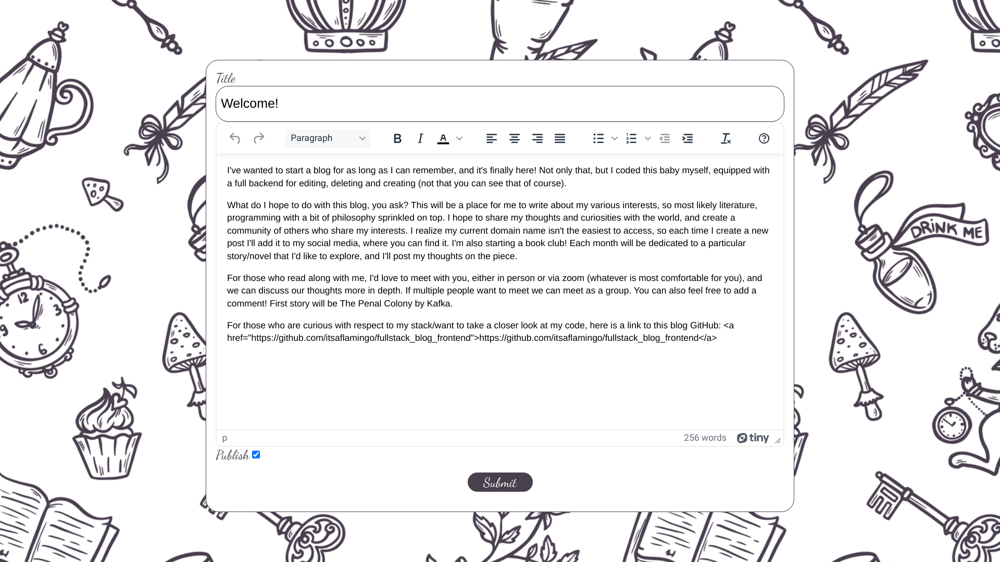
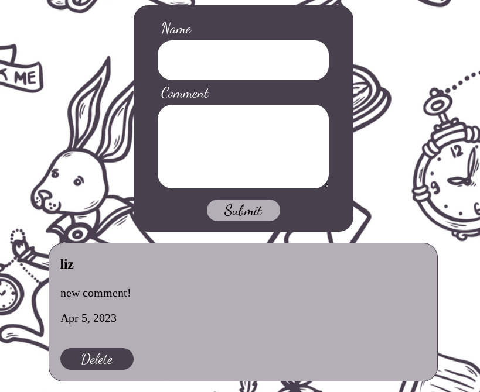

# Fullstack Blog
Blog created with Javascript, NodeJS, Express.js, Mongoose/MongoDB, React, TinyMCE

- [Live Demo](https://itsaflamingo.github.io/fullstack_blog_frontend/) :point_left:
- [Link to Backend](https://github.com/itsaflamingo/full_stack_blog_backend)

### Features

- Creator sign in using passportJS, jsonwebtoken
- Add comment
- List of dates & blog posts
- CRUD operations on blog posts
- Sign out
- Responsive design
- TinyMCE rich text editor

## Screenshots

## Built With

- [JavaScript](https://www.javascript.com/)
- [React](https://reactjs.org/)
- [Node.js](https://nodejs.org/en)
- [Express.js](https://expressjs.com/)
- [Mongoose.js](https://mongoosejs.com/)
- [PassportJS](https://www.passportjs.org/)
- [Jsonwebtoken](https://www.npmjs.com/package/jsonwebtoken)
- [TinyMCE](https://www.tiny.cloud/docs/tinymce/6/cloud-quick-start/)

